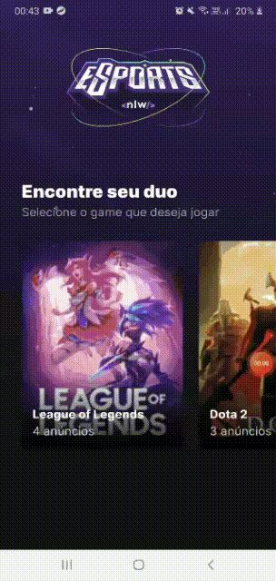

  <p align="center">
    <a href="https://unform.dev">
      
    </a>
  </p>

  
  ## Você ja quis achar algum companheiro para jogar o mesmo jogo que você? 
  O __NLW eSports__ trata-se de uma aplicação que permite com que jogadores criem seus anúncios ou achem seu _duo_ (parceiro) para jogar junto.
  
  <p align="center">
    
  </p>

## Índice
* [Features](#features)
* [Instalação](#instalação)
* [Tecnologias](#tecnologias)
* [Autor](#autor)

### Features

- [x] Listagem de jogadores disponíveis
- [ ] Criação de anúncios de jogadores
- [ ] Autenticação do usuário com o Discord

### Instalação

Antes de começar, você vai precisar ter instalado em sua máquina as seguintes ferramentas:
[Git](https://git-scm.com), [Node.js](https://nodejs.org/en/) e o [Expo](https://expo.dev/). 
Além disto, é importante ter um editor para trabalhar com o código como o [VSCode](https://code.visualstudio.com/)

### 📱 Rodando a aplicação mobile

#### ⚠️⚠️ O <a href="https://github.com/Leonardo-Oliveira1/nlw-esports-server">servidor</a> deverá ficar rodando em segundo plano para que este projeto consuma os dados do banco. ⚠️⚠️

```bash
# Clone este repositório
$ git clone https://github.com/Leonardo-Oliveira1/nlw-esports-mobile.git

# Acesse a pasta do projeto no terminal/cmd
$ cd nlw-esports-mobile

# Instale as dependências (essa instalação pode levar vários minutos)
$ npm install

# Copie no terminal o Ethernet Ethernet IPv4 do seu computador.
$ ipconfig

# Cole o seu ip na const IPv4 do arquivo src/utils/IPv4.ts
# Caso a porta do servidor for diferente de '3333', será necessário alterar a const Port no mesmo diretório acima.

# Abra o projeto escaneando pelo seu celular (Expo Go) ou utilizando o Android Studio e aguarde a instalação

# Execute a aplicação no terminal (Não utilize o GIT Bash para executar esse comando)
$ expo start

```

### Tecnologias

As seguintes ferramentas foram usadas na construção do projeto:

- Base do [Figma](https://www.figma.com/community/file/1150897317533332617).

- <a href="https://github.com/Leonardo-Oliveira1/nlw-esports-server">SERVER</a>
  - [Node.js](https://nodejs.org/en/)
  - [TypeScript](https://www.typescriptlang.org/)
  - [Hoppscotch](https://hoppscotch.io/)
  
- <a href="https://github.com/Leonardo-Oliveira1/nlw-esports-web">WEB</a>
  - [Vite](https://vitejs.dev/)
  - [React](https://reactjs.org/)
  - [Typescript](https://www.typescriptlang.org/)
  - [Sass](https://sass-lang.com/)
  - [Tailwind CSS](https://tailwindcss.com/)
  - [PostCss](https://postcss.org/)
  - [Redux](https://redux.js.org/)
  
- <a href="https://github.com/Leonardo-Oliveira1/nlw-esports-mobile">MOBILE</a>
  - [Expo](https://expo.io/)
  - [React Native](https://reactnative.dev/)
  - [TypeScript](https://www.typescriptlang.org/)


### Autor
---

Feito com ❤️ por Leonardo Oliveira 👋🏽 

[](mailto:oleonardo78@gmail.com)

<h4 align="center"> 
✔️  NLW eSports Mobile 💻🚀 Concluído  ✔️
</h4>

